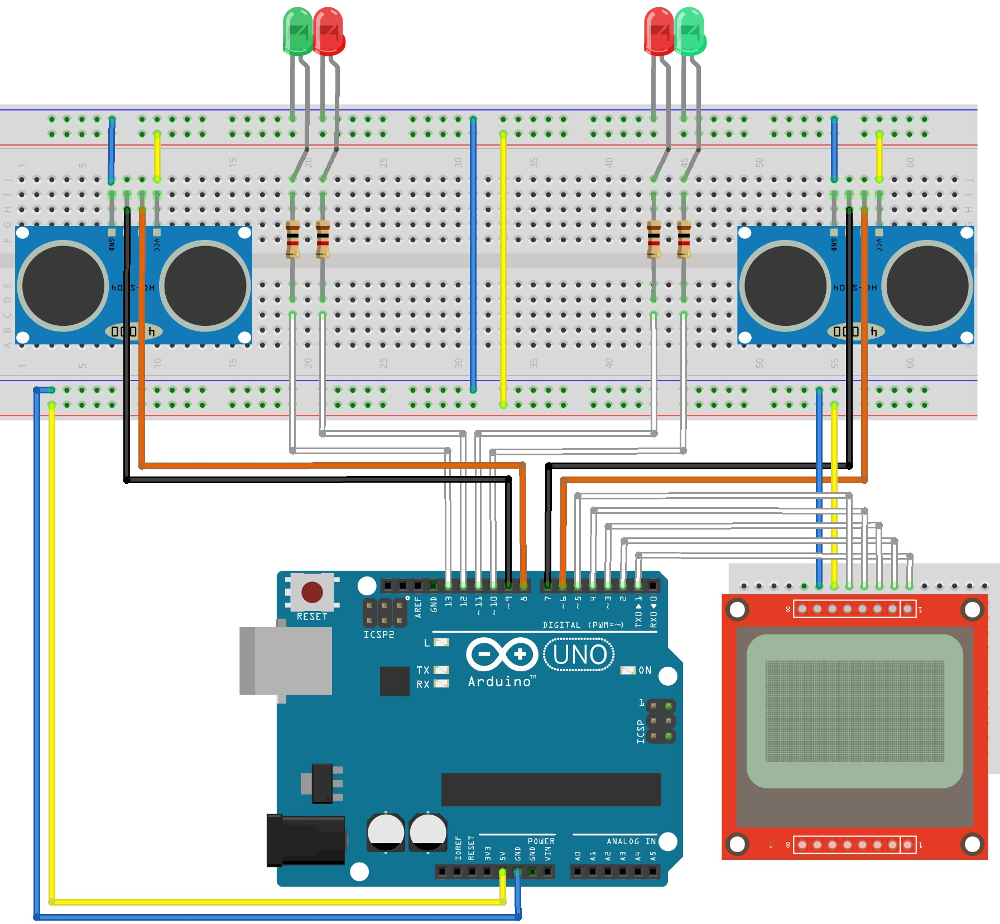
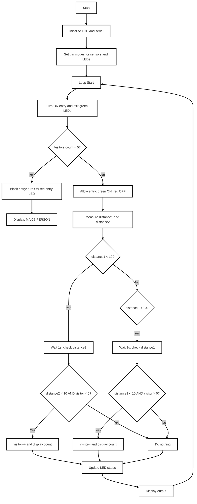

# Room Capacity Counter using Arduino Uno

This project is an automatic room occupancy monitor built with Arduino Uno. It uses two ultrasonic sensors (HC-SR04) to track people entering and exiting a room. The current number of occupants is displayed on a Nokia 5110 LCD. Red and green LEDs indicate entry and exit availability. When the maximum capacity is reached, entry is blocked.

---

## ⚙️ Features

- Real-time counting of people entering and exiting.
- LCD displays current room occupancy.
- LEDs signal allowed or blocked entry/exit.
- Max occupancy limit (default: 5 people).

---

## 📦 Components

| Component         | Description                        | Quantity |
|-------------------|------------------------------------|----------|
| Arduino Uno       | ATmega328P-based microcontroller   | 1        |
| HC-SR04           | Ultrasonic distance sensor         | 2        |
| Nokia 5110 LCD    | 84x48 pixel display (PCD8544)      | 1        |
| Red LED           | Entry/exit status indicator        | 2        |
| Green LED         | Entry/exit status indicator        | 2        |
| 1kΩ Resistor      | For LEDs                           | 4        |
| Breadboard        | Prototyping                        | 2        |
| Jumper wires      | Connections                        | -        |

---

## 🔌 Wiring Diagram

---

## 📈 Flowchart

---

## 🚀 Getting Started

1. Connect all components following the wiring diagram.
2. Upload the `Room_Capacity_Counter.ino` code to your Arduino Uno using Arduino IDE.
3. Power the Arduino using USB or a 7–12V adapter.
4. LCD will show the current number of people in the room.
5. LEDs indicate entry (green/red) and exit (green/red) availability.

---

## 📝 Notes

- People must pass sensors sequentially to be counted correctly.
- Movement should be steady and within detection range.
- Adjust delays or distance threshold in code for sensitivity tuning.

---

## 📁 Files in this Repository

- `Room_Capacity_Counter.ino` – Arduino code for the project.
- `README.md` – This documentation with wiring, flowchart, and instructions.
- `Сonnection_diagram.png` – Visual schematic of the component connections.
